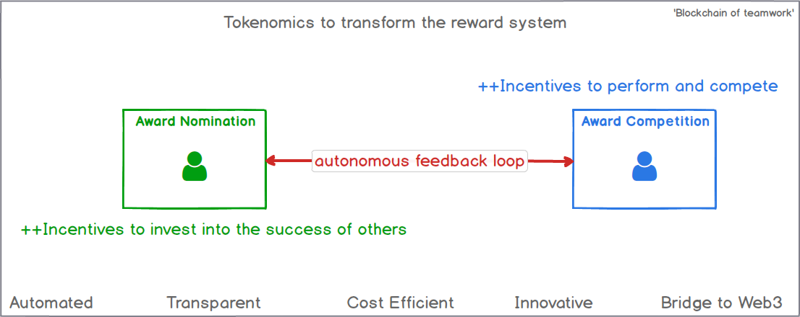

## Stake in Success - new incentive system for success recognition

**[Incentive theory](/Incentives.md)**

**[Design Principles](https://docs.google.com/presentation/d/1UZkhJqTsQ1D4cJM2yuyLzq9dN4dhGkqrkS6t7tTyMZw/edit?usp=sharing)**

## Design Overview

## Staking Contract Details

- [x] Staking creates an incentive model for anyone to stake into other people's success
- [x] Once a person gets recognized for their achievement - i.e. winning an award, everyone who staked in them is also rewarded
- [x] Two ERC20 tokens drive staking - StakingToken and RewardToken
- [x] StakingTokens are distributed to everyone
- [x] Supply and distribution of RewardTokens is controlled to increase value and decrease inflationary pressure of the token
- [x] StakingNominations allows staking, withdrawals and reward management
- [x] Award contract will rebase the staking rewards upon minting Award winners

## Award Contract Details

- [x] Awards contract has an overall budget, that can be augmented by addToAwardsBudget()
- [x] This will be a real transfer of ETH, the sender must be valid and have the amount of ETH in their account
- [x] Awards can then be minted
- [x] ETH will be moved from the Award budget, and vested for the winner for a vesting period (1 ETH currently for 10 days)
- [x] ETH in the individual award can be withdrawn, if vesting period has passed by withdrawAwardETH
- [x] Award will only be minted if there is available budget
- [x] Award will not be minted for organizers
- [x] On-chan AML check will be performed on winner's wallet to ensure it is not on a 'bad list' via Oracle
- [x] Off-chain HR check will be performed to ensure the award winner is still an employee when collecting vested award

- [ ] Figure out the on and off-chain identity matching / DID
      
-

Contract: [Kovan Etherscan](https://kovan.etherscan.io/address/0x29B746f28114a2D91eF4DF9315d16CE5e0C267Ae)

## Do you want to play a game?

- [x] Go to the Contract address on Etherscan, above
- [x] Find Contract tab, you should see verified checkmark
- [x] Select Write Contract
- [x] Connect your Metamask on Kovan testnet, make sure you have some test ETH (https://faucets.chain.link/)
- [x] Fund your Award contract to set the Award budget via addToAwardsBudget()
- [x] Set how much each award will be via setAwardAmountETH (in Wei).
- [x] Default is 1ETH (1+ 18 zeros), it might be a challenge to get this much test ETH - so lower this.
- [x] Create an award by mintWinner(), use https://gateway.pinata.cloud/ipfs/QmXreJ8rdSBihsDSVKkNG4J44VDJ8Et6bDsKdmBdfGyXH1 as tokenURI to test
- [x] In 10 days, the award ETH has vested and can be withdrawn to winner's wallet
